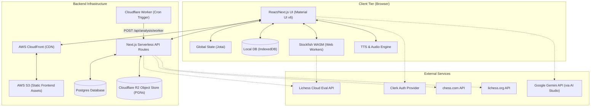

# High-Level Design (HLD) Document: Freechess

Freechess is a modern, open-source chess platform that enables users to play against engines, view, analyze, and review their games. It operates as an offline-first client application for local play and analysis, while providing optional cloud synchronization, automated background game analysis, and an AI-driven chess coaching experience.

---

## 1. System Architecture Overview

Freechess uses a hybrid architecture composed of a **Static Web App (AWS S3 + CloudFront)**, **Browser-Based Local Engines (Stockfish WASM)**, **Serverless API Routes (Next.js + Vercel/Node)**, and **Cloud Storage (Postgres + Cloudflare R2)**.

Below is the high-level architecture diagram detailing the component interactions:



---

## 2. Component Breakdown

### 2.1. Client Tier (Frontend)
*   **Next.js (React & TypeScript)**: Structured using the Next.js Pages router. Designed with modular page layouts (`play`, `database`, `insights`, `index/analysis`).
*   **Jotai**: Manages lightweight atomic states (e.g., active chessboard FENs, game evaluation history, chess engine settings, and running game states) to minimize react component re-renders.
*   **Material UI (MUI v6)**: Provides responsive layouts, custom slider components, and complex data grids (`@mui/x-data-grid`) for database listings. Customized with a sleek, premium dark-mode theme featuring gold accents (`#c9a227`).
*   **Chess Logic & Chessboard**: `react-chessboard` renders the SVG-based chessboard and accepts move inputs, while `chess.js` validates game rules (checking for mates, stalemates, draws, and legal moves).

### 2.2. Chess Engine Subsystem (Client-Side)
The application achieves high-performance local calculations directly within the browser:
*   **Web Workers**: Stockfish WASM engines (supports Stockfish 11 and Stockfish 17 Lite) are executed in background threads (`UciEngine.ts` and `worker.ts`). This keeps the UI responsive during deep calculations.
*   **Concurrency Controls**: The number of background worker threads is determined dynamically using the client device's hardware capabilities:
    ```typescript
    // Limit workers based on hardware threads, RAM, and platform
    const maxWorkersNbFromThreads = Math.max(1, Math.round(navigator.hardwareConcurrency - 4));
    const maxWorkersNbFromDevice = isIosDevice() ? 2 : isMobileDevice() ? 4 : 8;
    ```
*   **COOP/COEP Headers**: Stockfish WASM requires `SharedArrayBuffer` for multi-threaded transposition tables. To grant access to this browser API, the host server must issue strict security headers. These are configured in the `next.config.ts` headers and deployed on AWS CloudFront via custom `ResponseHeadersPolicy`:
    *   `Cross-Origin-Embedder-Policy: require-corp`
    *   `Cross-Origin-Opener-Policy: same-origin`
*   **Lichess Cloud Evaluation Fallback**: Before starting local Stockfish processing, the engine queries the Lichess Cloud Eval API. If a position's evaluation is cached at or above the desired search depth, it is resolved instantly, saving CPU cycles.

### 2.3. Storage Subsystem (Local vs. Cloud)
Freechess offers a dual-storage paradigm:
1.  **Local (IndexedDB)**:
    *   Powered by the `idb` wrapper in `useGameDatabase.ts`.
    *   Saves games, PGN records, and associated move-by-move evaluations directly on the client's browser database.
    *   Does not require authentication or user accounts.
2.  **Cloud Sync (PostgreSQL & Cloudflare R2)**:
    *   Users who authenticate via **Clerk** can sync their database to the cloud.
    *   **Postgres DB**: Stores user profiles, game metadata (ratings, players, dates, URLs), and analysis job states.
    *   **Cloudflare R2 Object Store**: Receives PGN file payloads via `@aws-sdk/client-s3`. Storing raw PGN files in R2 keeps database storage lightweight.

### 2.4. Background Cloud Analysis Subsystem
Rather than keeping the browser active to evaluate a long 60-move game, users can queue games for automated cloud analysis:
*   **Queueing API**: User calls `/api/analysis/jobs` with a list of game IDs.
*   **Cron Trigger**: A Cloudflare worker runs on a cron schedule (`*/1 * * * *`), making a POST request to `/api/analysis/worker` with a secret bearer token.
*   **Job Processor (`processor.ts`)**:
    *   Pulls the next queued job from PostgreSQL using `FOR UPDATE SKIP LOCKED` to prevent race conditions.
    *   Retrieves the game's PGN from Cloudflare R2.
    *   Compiles FENs and queries Lichess Cloud Eval API sequentially for each move.
    *   Runs move-classification (categorizing blunders, mistakes, brilliant moves) and calculates game accuracies and estimated ELO.
    *   Stores results in the `analysis_results` database table and marks the job as `completed`.

### 2.5. AI Chess Coach (Gemini Integration)
Integrated with `@google/generative-ai` on the client tier:
*   Summarizes the user's game metrics (win rate as white vs. black, openings accuracy, phase-wise strength, blunder count).
*   Sends a structured prompt directly to a Google Gemini model (e.g., `gemini-1.5-flash`, `gemini-1.5-pro`) using the user's private API key (cached in local storage).
*   Generates a highly-personalized, actionable report outlining the user's top 3 weaknesses and how they can improve.

---

## 3. Data Models & Database Schema

The Postgres database (defined in [cloud-insights-schema.sql](file:///Users/prathamshah/Desktop/Work/Personal/Freechess/src/server/sql/cloud-insights-schema.sql)) consists of four core tables:

### 3.1. `users`
Tracks authenticated user IDs from Clerk.
*   `id` (TEXT, PK): Unique Clerk User ID.
*   `created_at` (TIMESTAMPTZ, Default: NOW).

### 3.2. `games`
Stores metadata for games imported from third-party sites or played locally.
*   `id` (UUID, PK): Auto-generated unique ID.
*   `user_id` (TEXT, FK references `users(id)`).
*   `source` (TEXT): Must be `lichess` or `chess.com`.
*   `external_game_id` (TEXT): The game's ID on Lichess or Chess.com.
*   `pgn_text` (TEXT): Complete PGN contents.
*   `pgn_r2_key` (TEXT): The location of the raw PGN file in the Cloudflare R2 bucket.
*   `pgn_sha256` (TEXT): Hash of the PGN content to prevent duplicates.
*   `played_at` (TIMESTAMPTZ).
*   `white_name` / `white_rating` (TEXT / INTEGER).
*   `black_name` / `black_rating` (TEXT / INTEGER).
*   `result` (TEXT): e.g., `"1-0"`, `"0-1"`, `"1/2-1/2"`.
*   `time_control` / `url` (TEXT).
*   *Indexes*:
    *   Unique constraint on `(source, external_game_id)`.
    *   Unique constraint on `(user_id, pgn_sha256)`.
    *   Index on `(user_id, played_at DESC)` for fast dashboard loading.

### 3.3. `analysis_jobs`
Coordinates background analysis workers.
*   `id` (UUID, PK).
*   `user_id` (TEXT, FK references `users(id)`).
*   `game_id` (UUID, FK references `games(id)`).
*   `status` (TEXT): Enforced enum: `'queued'`, `'processing'`, `'completed'`, `'failed'`.
*   `provider` (TEXT): Defaults to `'lichess-cloud-eval'`.
*   `depth` / `multi_pv` (INTEGER).
*   `retries` (INTEGER) / `error` (TEXT).
*   *Indexes*:
    *   Index on `(status, created_at ASC)` so workers pull the oldest queued jobs first.

### 3.4. `analysis_results`
Stores completed position evaluation JSON payloads.
*   `game_id` (UUID, PK, FK references `games(id)`).
*   `eval_json` (JSONB): Structured analysis data containing position FENs, PV paths, move classifications, and final accuracies.

---

## 4. Key Workflows & Network Flows

### 4.1. External Game Ingestion Flow
This flow details how games from Chess.com or Lichess.org are imported into the cloud account:
1.  The user provides their third-party username on the interface.
2.  The client invokes `/api/ingest/games`, passing the games array fetched from external APIs.
3.  The API route checks session token verification via Clerk (`requireUserId`).
4.  For each game:
    *   Computes PGN SHA-256 hash.
    *   Saves the raw PGN string to Cloudflare R2 under key `users/${userId}/${source}/${gameId}.pgn`.
    *   Inserts game metadata into `games` table in Postgres (resolves conflicts via `ON CONFLICT DO UPDATE`).
5.  Returns a success summary (`{ inserted, updated, games }`) to the dashboard.

### 4.2. Local vs. Cloud Analysis Selection Flow
```
                      [ User Requests Game Review ]
                                    |
                                    v
                         Is User Authenticated?
                         /                  \
                       Yes                   No
                       /                      \
             Can use Cloud Worker?          Run Local Analysis
             /                  \           - Fetch Lichess Cloud Eval
           Yes                   No         - Fallback to Stockfish WASM
           /                      \         - Store results in IndexedDB
     Queue Job API           Run Local Analysis
  (/api/analysis/jobs)
```

---

## 5. Security & Deployment Architecture

*   **AWS S3**: Hosts static-compiled frontend builds (HTML, JS, CSS, client-side images).
*   **AWS CloudFront**: Serves as the CDN. Implements a `ResponseHeadersPolicy` that injects the required COOP and COEP headers, making sure local multithreaded engines can run securely.
*   **Clerk Auth**: Session-based JSON Web Tokens (JWT) secure all Next.js serverless API routes (`/api/*`).
*   **Postgres SSL**: Enforces SSL connection parameters in production environments.
*   **Analysis Worker Token**: Cloudflare Workers authorize themselves against the API using a private bearer token (`ANALYSIS_WORKER_TOKEN`) stored in Environment Variables.
