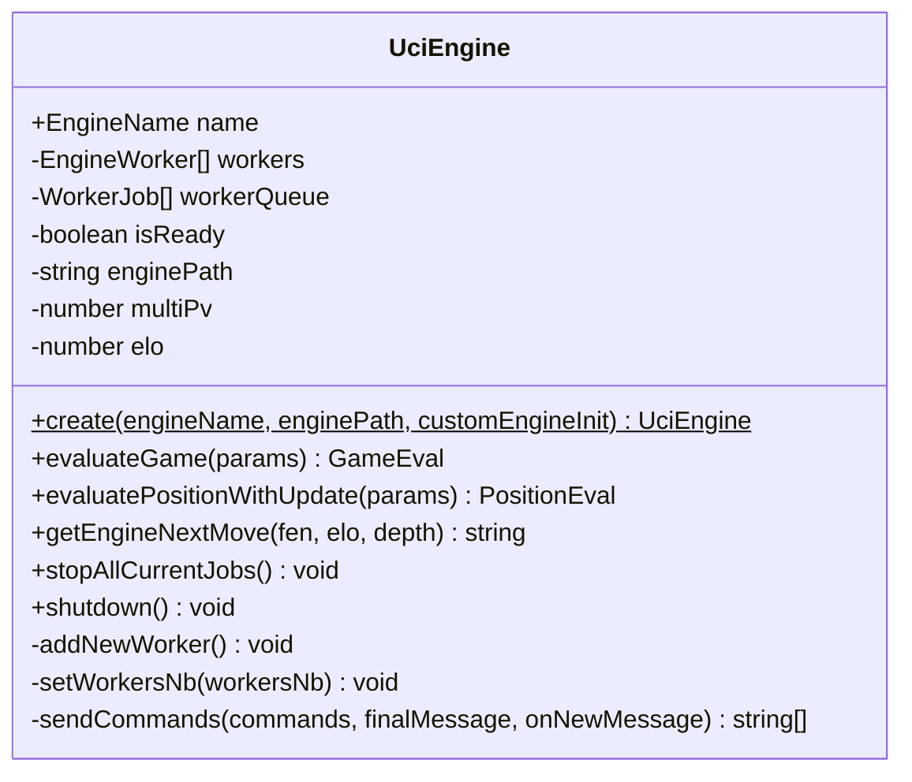

# Low-Level Design (LLD) Document: Freechess

This document provides a detailed, file-by-file and module-by-module breakdown of the architectural components in Freechess. It details state structures, class interfaces, DB schemas, background task locking, and LLM integrations.

---

## 1. Client-Side State Management (Jotai Atoms)

Freechess uses **Jotai** for atomic, decoupled state management. Global states are isolated into domain-specific files.

### 1.1. Analysis Board Domain (`src/sections/analysis/states.ts`)

Tracks the current state of the main Analysis board, engine profiles, and UI configurations.

| Atom Name                  | Type                     | Initial Value / Defaults       | Purpose                                                                          |
| :------------------------- | :----------------------- | :----------------------------- | :------------------------------------------------------------------------------- |
| `gameAtom`               | `Chess`                | `new Chess()`                | Holds the full active game state history.                                        |
| `boardAtom`              | `Chess`                | `new Chess()`                | Represents the currently viewed position on the board.                           |
| `gameEvalAtom`           | `GameEval \| undefined` | `undefined`                  | Stores completed evaluation analytics (accuracy, estimated ELO, classification). |
|                            |                          |                                |                                                                                  |
|                            |                          |                                |                                                                                  |
| `currpostonAtom`         | `CurrentPosition`      | `{}`                         | Holds real-time evaluation details of the active position.                       |
| `boardOrientationAtom`   | `boolean`              | `true` (White)               | Dictates which side is rendered at the bottom.                                   |
| `showBestMoveArrowAtom`  | `boolean`              | `true`                       | UI toggle to display engine's recommended path.                                  |
| `showPlayerMoveIconAtom` | `boolean`              | `true`                       | UI toggle to overlay classification icons (e.g., blunder/brilliant).             |
| `engineNameAtom`         | `EngineName`           | `EngineName.Stockfish17Lite` | Active client engine selection.                                                  |
| `engineDepthAtom`        | `number`               | `14`                         | Target calculation depth.                                                        |
| `engineMultiPvAtom`      | `number`               | `3`                          | Number of best move paths to calculate simultaneously.                           |
| `engineWorkersNbAtom`    | `number`               | `getRecommendedWorkersNb()`  | Thread count allocating web workers.                                             |
| `evaluationProgressAtom` | `number`               | `0` (percentage)             | Progress indicator of current analysis.                                          |
| `savedEvalsAtom`         | `SavedEvals`           | `{}`                         | Dictionary mapping FEN -> partial/full evaluation JSON.                          |
| `isExplanationMutedAtom` | `boolean`              | `false`                      | TTS and coach text feedback mute flag.                                           |

### 1.2. Play Bot Domain (`src/sections/play/states.ts`)

Manages state for games played locally against Stockfish.

| Atom Name                | Type                | Default Value                  | Purpose                                                    |
| :----------------------- | :------------------ | :----------------------------- | :--------------------------------------------------------- |
| `gameAtom`             | `Chess`           | `new Chess()`                | Local play rules engine.                                   |
| `gameDataAtom`         | `CurrentPosition` | `{}`                         | Evaluation values of the playing game.                     |
| `playerColorAtom`      | `Color`           | `Color.White`                | Player side selection.                                     |
| `enginePlayNameAtom`   | `EngineName`      | `EngineName.Stockfish17Lite` | Engine model utilized by the opponent bot.                 |
| `engineEloAtom`        | `number`          | `1320`                       | Dynamic Elo level of the engine opponent.                  |
| `isGameInProgressAtom` | `boolean`         | `false`                      | Active game flag. Disables configuration panels when true. |
| `soundThemeAtom`       | `SoundTheme`      | `SoundTheme.Standard`        | Theme selector for audio triggers.                         |

---

## 2. Client-Side Engine Evaluation (`src/lib/engine/`)

The client engine system controls asynchronous Web Workers executing Stockfish WASM through a structured wrapper class.



### 2.1. Class Interface: `UciEngine.ts`

* `public static async create(engineName, enginePath, customEngineInit?)`: Factory builder that instantiates the engine and pre-warms the initial worker pool.
* `public async evaluateGame({ fens, uciMoves, depth, multiPv, setEvaluationProgress, playersRatings, workersNb })`:
  1. Sets requested `MultiPV`.
  2. Spawns workers up to `workersNb`.
  3. Iterates through FEN list:
     * Checks `getLichessEval(fen)` for cached entries (depth >= target).
     * If not found, calls `evaluatePosition(...)` to compute via local Web Workers.
  4. Processes outputs to derive move classifications, game accuracies (`computeAccuracy`), and estimated ELO (`computeEstimatedElo`).
* `public async evaluatePositionWithUpdate({ fen, depth, multiPv, setPartialEval })`:
  * Stops all running engine jobs.
  * Kicks off Lichess cloud fetch and local calculation concurrently.
  * Triggers `setPartialEval` on receiving worker search messages (`info depth ... cp ...`) to update the evaluation bar in real-time.
* `public async getEngineNextMove(fen, elo, depth)`:
  * Sets options: `UCI_LimitStrength` = `true` and `UCI_Elo` = `elo`.
  * Instructs worker: `position fen [fen]`, then `go depth [depth]`.
  * Resolves with the command starting with `bestmove`.

### 2.2. Web Worker Communication Wrapper (`src/lib/engine/worker.ts`)

Wraps the browser `Worker` instance to coordinate UCI inputs and outputs using promises:

* `getEngineWorker(enginePath)`: Returns an `EngineWorker` object containing:
  * `uci(command)`: Proxies message commands using `worker.postMessage(command)`.
  * `listen(callback)`: Custom listener handler.
  * `terminate()`: Ends the worker thread.
* `sendCommandsToWorker(worker, commands, finalMessage, onNewMessage?)`: Sends a series of commands (e.g. `['position fen ...', 'go depth ...']`) and returns a Promise that resolves when a message starting with `finalMessage` (e.g., `"bestmove"`, `"uciok"`, `"readyok"`) is captured.

---

## 3. Storage Layer & API Design

### 3.1. Local Browser Storage: IndexedDB Schema

Managed through `src/hooks/useGameDatabase.ts` utilizing the `idb` library.

* **Database Name**: `"games"`
* **Version**: `1`
* **Object Store**: `"games"` (Key Path: `"id"`, Auto-increment: `true`)
* **Entity Data Structure (`Game`)**:
  ```typescript
  interface Game {
    id?: number;
    pgn: string;
    eval?: GameEval;
    event?: string;
    site?: string;
    date?: string;
    round?: string;
    white: { name?: string; rating?: number };
    black: { name?: string; rating?: number };
    result?: string;
    timeControl?: string;
  }
  ```

### 3.2. Relational Database Schema (PostgreSQL)

Initialized via [cloud-insights-schema.sql](file:///Users/prathamshah/Desktop/Work/Personal/Freechess/src/server/sql/cloud-insights-schema.sql).

```
  ┌──────────┐          ┌──────────┐          ┌───────────────┐
  │  users   │1       * │  games   │1       1 │analysis_result│
  ├──────────┤─────────>├──────────┤─────────>├───────────────┤
  │ id (PK)  │          │ id (PK)  │          │ game_id (PK)  │
  └──────────┘          │ user_id  │          │ eval_json     │
      │1                └──────────┘          └───────────────┘
      │                       ▲1
      │*                      │
  ┌───────────────┐           │
  │ analysis_jobs │*          │
  ├───────────────┤───────────┘
  │ id (PK)       │
  │ game_id (FK)  │
  │ status        │
  └───────────────┘
```

### 3.3. API Endpoint Contracts

All API endpoints reside under `src/pages/api/`. Non-public endpoints enforce auth verification via Clerk's `requireUserId`.

#### 1. Ingest External Games (`/api/ingest/games`)

* **Method**: `POST`
* **Request Body**:
  ```json
  {
    "source": "lichess" | "chess.com",
    "games": [{ "id": "external_id", "pgn": "...", "date": "...", "white": {}, "black": {}, "result": "..." }]
  }
  ```
* **Logic**:
  1. Extracts user identity from Clerk.
  2. For each game, calls `getPgnSha256(pgn)` and generates R2 object key: `users/${userId}/${source}/${externalGameId}.pgn`.
  3. Uploads the raw PGN string to Cloudflare R2 bucket.
  4. Performs transactional `INSERT` into the `games` table. Resolves conflicts using `ON CONFLICT (source, external_game_id) DO UPDATE`.
* **Response (200)**: `{ inserted: number, updated: number, games: CloudGame[] }`

#### 2. Query User Games (`/api/games`)

* **Method**: `GET`
* **Params**: `source` (`'lichess' | 'chess.com' | 'all'`), `includeEval` (`'true' | 'false'`)
* **Logic**: Returns list of games metadata from Postgres. If `includeEval` is true, performs a `LEFT JOIN` on the `analysis_results` table.
* **Response (200)**: `{ games: CloudGame[] }`

#### 3. Queue Analysis Jobs (`/api/analysis/jobs`)

* **Method**: `POST`
* **Request Body**: `{ gameIds: string[], depth?: number, multiPv?: number }`
* **Logic**: Enqueues new jobs in `analysis_jobs` with status `'queued'`.
* **Response (200)**: `{ jobIds: string[] }`

#### 4. Background Job Tick Worker (`/api/analysis/worker`)

* **Method**: `POST`
* **Headers**: `Authorization: Bearer <ANALYSIS_WORKER_TOKEN>`
* **Process flow (`src/server/analysis/processor.ts`)**:
  1. Executes atomic update with lock selection:
     ```sql
     UPDATE analysis_jobs j
     SET status = 'processing', updated_at = NOW()
     FROM games g
     WHERE j.id = (
       SELECT id FROM analysis_jobs
       WHERE status = 'queued'
       ORDER BY created_at ASC
       LIMIT 1
       FOR UPDATE SKIP LOCKED
     ) AND g.id = j.game_id
     RETURNING j.id, j.game_id, j.user_id, j.depth, j.multi_pv, g.white_rating, g.black_rating, g.pgn_r2_key;
     ```
  2. If no job returns, exits early (`{ processed: false }`).
  3. Fetches PGN payload from R2 using `pgn_r2_key`.
  4. Instantiates a server-side `Chess` board, loops moves to collect FEN list.
  5. Sequentially retrieves FEN calculations from Lichess Cloud Eval API.
  6. Computes estimated ELO rating, move classification, and game accuracy.
  7. Writes evaluations to `analysis_results` and updates the job status to `'completed'`.
  8. If an exception occurs, marks the job as `'failed'` and logs the error details.
* **Response (200)**: `{ processed: true, jobId: string, status: 'completed' | 'failed' }`

---

## 4. LLM Coaching Prompt & Integration (`src/sections/insights/CoachTab.tsx`)

Configures Google Gemini on the client side using player performance aggregations:

1. **Metric Aggregator**: Gathers statistical bounds from the active dataset:
   * Overall average accuracy percentage.
   * Accuracy splits as White vs. Black.
   * Win/Loss/Draw ratios per color.
   * Phase accuracy (Opening, Middlegame, Endgame).
   * Total count of blunders, mistakes, and inaccuracies.
   * Top 3 opening win rates for White and Black.
2. **Prompt Construction**: Creates a context injection prompt:
   ```
   You are a chess coach analyzing a player's performance.
   Based on the following structured data, identify the player's TOP 3 weaknesses.

   DATA:
   * Overall accuracy: {avgAccuracy}%
   * Win rate: {winRate}%
   ...
   * Opening performance: {opening_stats}

   TASK:
   1. Identify the 3 most critical weaknesses
   2. Be specific (NOT generic like "improve tactics")
   3. Use patterns (e.g., "losing advantage in middlegame", "poor performance with White")
   4. Prioritize impact on winning

   OUTPUT FORMAT:
   * Weakness 1: <clear explanation>
   * Weakness 2: <clear explanation>
   * Weakness 3: <clear explanation>
   ```
3. **Model Configuration**: Utilizes `@google/generative-ai` SDK initialized with the user's API key. Fetches available models from Google's endpoint (`https://generativelanguage.googleapis.com/v1/models`) and binds the request using `generateContent` method on the user-selected model.
